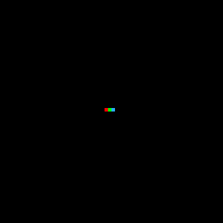

# Drawing and animating

This section serves as an entry point for start using Pizzoo, first we'll gonna talk about initialization to then lets go through some simple examples that demonstrate the basic functionalities of creating animations and games on your chosen renderer.

## Initialization
If you are using the Pixoo64, be sure to first know wich IP it has, a [complete guide is found here](/installation/#simple-connection-test). If you are using any of the other included renderers (A static image/gif renderer or a window renderer) you can change them on the initialization:
```python
import  ImageRenderer, WindowRenderer from pizzoo

# For the default Pixoo64 renderer is just:
pizzoo = Pizzoo('your-local-ip', debug=True)
# First parameter can be empty because no URL/IP connection is being made
pizzoo = Pizzoo('', renderer=ImageRenderer, debug=True)
# For the WindowRenderer:
pizzoo = Pizzoo('', renderer=WindowRenderer, debug=True)
```

## Drawing/render a single frame
Frame manipulation is the core of the `pizzoo` library. Every time the library is created and the `render` method is called, the buffer is filled with a new frame we can use to draw on. Lets start by drawing three pixels on the screen and rendering:

!!! example "Working example"
	```python
	pizzoo.cls() # Clear the screen with black color (By default)
	pizzoo.draw_pixel((30, 31), '#ff0000') # Red pixel, using the hex color format
	pizzoo.draw_pixel((31, 31), (0, 255, 0)) # Green pixel, using the RGB tuple format
	pizzoo.draw_pixel((32, 31), 12) # An integer color between 0 and 15 is a pico-8 palette color (https://lospec.com/palette-list/pico-8)
	pizzoo.render() # Render the frame to the Pixoo device, this is mandatory to see the changes on the device
	```

	<figure markdown="span">
	{ width="300" }
		<figcaption>This will create 3 pixels centered on the middle of the screen</figcaption>
	</figure>

We can also try with some shapes:

!!! example "Working example"
	```python
	pizzoo.cls()
	pizzoo.draw_circle((31, 31), 10, '#00ff00', filled=True) # Green circle, filled
	pizzoo.draw_rectangle((26, 26), 11, 11, '#ff0000', filled=False) # Red rectangle, not filled
	pizzoo.draw_line((31, 0), (31, 63), '#0000ff') # Blue line
	pizzoo.draw_line((0, 31), (63, 31), (255, 255, 0)) # Yellow line, tuple rgb color format
	pizzoo.render()
	```

	<figure markdown="span">
		
		<figcaption>Depth sorting will always be from bottom to top, on order of calling.</figcaption>
	</figure>

Or also draw some text with the default font and even importing some more fonts (Currently the [only font format accepted is the `bdf` one](https://en.wikipedia.org/wiki/Glyph_Bitmap_Distribution_Format), as they were designed for low pixel density displays):

!!! example "Working example"
	```python
	pizzoo.load_font('artos', './files/ArtosSans-8.bdf')
	pizzoo.load_font('amstrad', './files/amstrad_cpc_extended.bdf')
	pizzoo.cls((255, 255, 255))
	pizzoo.draw_text('Amstrad', xy=(2, 2), font='amstrad', color='#00ff00') # Custom amstrad font, no wrap is defined
	pizzoo.draw_text('Artos', xy=(2, 12), font='artos', color=(255, 0, 0), line_width='auto') # Custom artos font, wrap is 'auto' so full device width (64px)
	pizzoo.draw_text('This is a pretty big text using the default font for the library.', xy=(1, 24), color='#000000', line_width=62) # Default font, custom line width
	pizzoo.render()
	```

	<figure markdown="span">
		
		<figcaption>Line width allows us to wrap the text when is too large.</figcaption>
	</figure>

## Playing with animations
As `pizzoo` is implemented as an animation buffer manipulation library on its core, any animation can be drawn with the aid of some simply methods of the base class.

### Creating your first animation
When using Pizzoo, the most straigh-forward way of creating and animation is drawing a single GIF file. This will create/draw on available frames as needed until the gif is completely drawn or at least the maximum number of frames is fullfilled:

!!! example "Working example"
	```python
	pizzoo.cls()
	pizzoo.draw_gif('./files/test_gif.gif', xy=(15, 15), size=(32, 32), loop=True) # Draw a gif on the center of the screen
	pizzoo.render()
	```

	<figure markdown="span">
		
		<figcaption>Number of gifs frames are limited by the maximum on said renderer.</figcaption>
	</figure>

### Creating custom animations
Aside from gifs, you can create any more advanced animation by using the method `add_frame`. This will create a new frame that will be the new target of any applied drawing method. Calling `render` after you finished will send every processed frame and restart the full buffer.

!!! example "Working example"
	```python
	'''
	This will create a simple diagonal moving circle
	'''
	for i in range(0, 54):
		pizzoo.cls()
		pizzoo.draw_circle((i + 4, i + 4), 2, '#00ff00', filled=True)
		pizzoo.add_frame()
	pizzoo.render(frame_speed=100)
	```
	<figure markdown="span">
		
		<figcaption>Any complex animation can be made this way.</figcaption>
	</figure>

## Using templates
One of the most powerful uses of the library is the use of XML/HTML like templates. These templates use relative positioning by default, so different reusable pieces can be crafted for different templates, and even percentage sizing can be used.

!!! example "Working example"
	```python
	'''
	This template uses custom nodes for Pixoo64, as date or time, so these are missing when 
	rendering on any other renderer
	'''
	pizzoo.load_font('amstrad', './files/amstrad_cpc_extended.bdf')
	pizzoo.render_template('''
		<pizzoo>
			<rectangle x="0" y="0" width="100%" height="100%" color="8" filled="true">
				<section x="0" y="2">
					<date format="DD" x="1" color="#ffc107" font="small"></date>
					<text x="9" color="#ffc107">-</text>
					<date format="MM" x="13" color="#ffc107" font="small"></date>
					<time format="HH:mm" x="26" font="small"></time>
					<date format="WWW" width="63" x="50" color="#ffc107" font="small"></date>
				</section>
				<section x="5" y="10" width="53" height="43">
					<rectangle x="0" y="0" width="100%" height="100%" color="#FFFFFF" filled="true" />
					<section x="1" y="1" width="51" height="51">
						<text x="0" y="0" color="#000000" wrap="true">Long text wrapped</text>
						<text x="10" y="80%" shadow="diagonal" color="#FF0000" font="amstrad">Cool</text>
						<image x="17" y="40%" src="./files/test_image.png" />
					</section>
				</section>
			</rectangle>
		</pizzoo>
	''')
	```

	<figure markdown="span">
		
		<figcaption>Note how elements positions are relative by default to the parent's one.</figcaption>
	</figure>

As this is a pretty extense feature, a dedicated guide for creating your own templates [is available here](). So you can learn how every node and attribute works and how to extend the compilation to add your own nodes for your custom renderers.