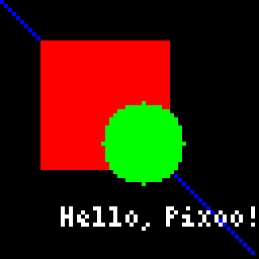

# Rendering XML templates

The `render_template` method in the Pizzoo library allows you to create and send XML templates to the Pixoo64 device. This feature provides a flexible way to design and render graphical elements on the device using an XML-based structure.

## Overview

The XML template renderer is a powerful feature that, given a valid XML, compiles the whole screen, making even easier to create custom watchfaces or visual integrations. The tags represent shapes, text, images, and other elements that can be rendered on the Pixoo64. Additionally, the `<pizzoo>` root tag can include attributes to configure global settings like brightness, background, and notifications.

### Supported Tags

Below is a list of supported tags and their attributes:

1. **`<section>`**  
	A container for other elements, with no visual output.  
	**Attributes**:
	- `x`, `y`: Position of the section.
	- `width`, `height`: Dimensions of the section.
	- `position`: Can be `static`, `relative`, or `absolute`.

2. **`<rectangle>`**  
	Draws a rectangle.  
	**Attributes**:
	- `x`, `y`: Position of the rectangle.
	- `width`, `height`: Dimensions of the rectangle.
	- `color`: Color of the rectangle (e.g., `#FF0000` or `7`).
	- `filled`: Whether the rectangle is filled (`true` or `false`).

3. **`<circle>`**  
	Draws a circle.  
	**Attributes**:
	- `x`, `y`: Center position of the circle.
	- `radius`: Radius of the circle.
	- `color`: Color of the circle.

4. **`<text>`**  
	Draws a given text.  
	**Attributes**:
	- `x`, `y`: Position of the text.
	- `color`: Color of the text.
	- `font`: Font to use (default is `'default'`), you can use any font that is previously loaded.
	- `wrap`: Whether to wrap text (`true` or `false`).
	- `shadow`: Shadow offset (e.g., `(1,1)`), default value is no shadow.
	- `shadowColor`: Color of the shadow.

5. **`<pixel>`**  
	Draws a single pixel.  
	**Attributes**:
	- `x`, `y`: Position of the pixel.
	- `color`: Color of the pixel.

6. **`<image>`**  
	Draws an image.  
	**Attributes**:
	- `x`, `y`: Position of the image.
	- src: Path to the image file.

7. **`<line>` (General)**  
	Draws a line.  
	**Attributes**:
	- `x`, `y`: Start position of the line.
	- `x2`, `y2`: End position of the line.
	- `color`: Color of the line.

8. **`<message>` (Pixoo64-Specific)**  
	Displays a scrolling message on the screen.  
	**Attributes**:
	- `x`, `y`: Position of the message.
	- `color`: Color of the text.
	- `font`: Font size or type , Pixoo64 native fonts can be found [here](https://app.divoom-gz.com/Device/GetTimeDialFontList), default is `2` and if `small` is used it will use the font `18`, any other value will be mapped against the given list. Only fonts with `type=0` from the list will scroll, so they are the recommended ones.
	- `scroll`: Direction of scrolling (`left` or `right`).
	- `speed`: Scrolling speed (1–100).
	**Example**:
	```xml
	<message x="0" y="0" color="#FFFFFF" font="2" scroll="left" speed="50">
		Welcome to Pixoo!
	</message>
	```
  
9. **`<time>` (Pixoo64-Specific)**  
	Displays the current time and auto-updates.  
	**Attributes**:
	- `x`, `y`: Position of the time.
	- `color`: Color of the text.
	- `font`: Font size or type, Pixoo64 native fonts can be found [here](https://app.divoom-gz.com/Device/GetTimeDialFontList), default is `2` and if `small` is used it will use the font `18`, any other value will be mapped against the given list.
	- `format`: Time format (e.g., `HH:mm:ss`, `HH:mm`, `HH`).
	**Example**:
	```xml
	<time x="10" y="10" color="#FFFFFF" font="2" format="HH:mm:ss" />
	```

10. **`<temperature>` (Pixoo64-Specific)**  
	Displays the current temperature and auto-updates.  
	**Attributes**:
	- `x`, `y`: Position of the temperature.
	- `color`: Color of the text.
	- `font`: Font size or type, Pixoo64 native fonts can be found [here](https://app.divoom-gz.com/Device/GetTimeDialFontList), default is `2` and if `small` is used it will use the font `18`, any other value will be mapped against the given list.
	- `kind`: Type of temperature to display:
	- `actual`: Current temperature.
	- `max`: Maximum temperature of the day.
	- `min`: Minimum temperature of the day.
	**Example**:
	```xml
	<temperature x="20" y="20" color="#FF0000" font="2" kind="actual" />
	```

11. **`<weather>` (Pixoo64-Specific)**  
	Displays the current weather condition as text and auto-updates.  
	**Attributes**:
	- `x`, `y`: Position of the weather text.
	- `color`: Color of the text.
	- `font`: Font size or type, Pixoo64 native fonts can be found [here](https://app.divoom-gz.com/Device/GetTimeDialFontList), default is `2` and if `small` is used it will use the font `18`, any other value will be mapped against the given list.
	**Example**:
	```xml
	<weather x="30" y="30" color="#00FF00" font="2" />
	```

12. **`<date>` (Pixoo64-Specific)**  
	Displays the current date and auto-updates.  
	**Attributes**:
	- `x`, `y`: Position of the date.
	- `color`: Color of the text.
	- `font`: Font size or type, Pixoo64 native fonts can be found [here](https://app.divoom-gz.com/Device/GetTimeDialFontList), default is `2` and if `small` is used it will use the font `18`, any other value will be mapped against the given list.
	- `format`: Date format (e.g., `DD/MM/YYYY`, `DD`, `MM`, `YYYY`).
	**Example**:
	```xml
	<date x="40" y="40" color="#FFFFFF" font="2" format="DD/MM/YYYY" />
	```

### Root Tag Attributes

The `<pizzoo>` root tag can include the following attributes:

- `brightness`: Sets the screen brightness (0–100).
- `turnOn`: Turns the screen on (`true` or `false`).
- `notification`: Triggers a notification sound (`true` or `false`).
- `background`: Sets a background color or image (e.g., `#000000` or `background.gif`).

---

## Example XML Template

Here is an example of an XML template that demonstrates the use of various tags:

```xml
<pizzoo brightness="80" turnOn="true" background="#000000">
	<section x="10" y="10" width="50%" height="50%" position="relative">
		<rectangle x="0" y="0" width="100%" height="100%" color="#FF0000" filled="true" />
		<circle x="25" y="25" radius="10" color="#00FF00" />
		<text x="5" y="40" color="#FFFFFF" font="default" shadow="(1,1)" shadowColor="#000000">
			Hello, Pixoo!
		</text>
	</section>
	<line x="0" y="0" x2="63" y2="63" color="#0000FF" />
	<pixel x="32" y="32" color="#FFFF00" />
	<image x="10" y="10" src="files/test_image.png" />
</pizzoo>
```

<figure markdown="span">
	
	<figcaption>The compiled result.</figcaption>
</figure>

---

## Steps to Render the Template

1. **Initialize the Pizzoo Object**  
   Create an instance of the Pizzoo class and specify the Pixoo64's IP address.

   ```python
   from pizzoo import Pizzoo

   pixoo = Pizzoo(address="192.168.1.100")
   ```

2. **Define the XML Template**  
   Write the XML template as a string.

   ```python
   template = """
   <pizzoo brightness="80" turnOn="true" background="#000000">
       <rectangle x="10" y="10" width="20" height="20" color="#FF0000" filled="true" />
       <text x="5" y="40" color="#FFFFFF">Hello, Pixoo!</text>
   </pizzoo>
   """
   ```

3. **Render the Template**  
   Use the `render_template` method to send the template to the Pixoo64.

   ```python
   pixoo.render_template(template)
   ```

---

## Advanced Features

### Positioning Modes
- **`static`**: Positions are relative to the last non-absolute parent.
- **`relative`**: Similar to `static`, but absolute children are relative to this element (This is the default one if another one is not specified).
- **`absolute`**: Positions are absolute relative to the last relative element or the screen.

### Custom Renderer Nodes
If you are using a custom renderer, you can extend the functionality by adding your own nodes. The `__compile_node` method in the renderer can be overridden to handle custom tags.

---

## Notes

- Ensure the root tag is `<pizzoo>`. Any other root tag will raise an error.
- The `render_template` method automatically resets the buffer before rendering.
- The `Pixoo64Renderer` handles communication with the Pixoo64 device using its API.